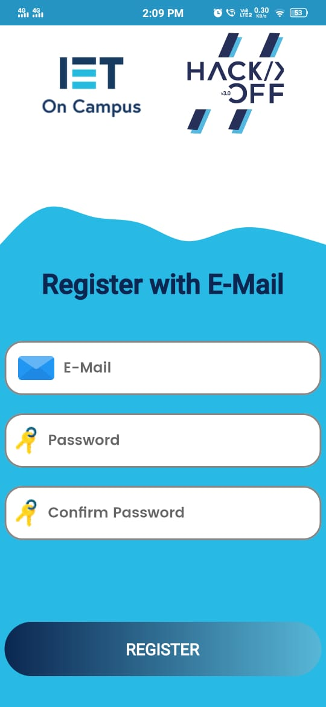

# IET-VIT Mobile App

A flutter app developed to support iOS for the exsisting [android app](https://github.com/Team-Fourth-Dimension/IET-VIT_app).

## Getting Started

Follow these instructions to build and run the project

### Setup Flutter

A detailed guide for multiple platforms setup could be find [here](https://flutter.dev/docs/get-started/install/)

### Next Steps

- Clone this repository.
- `cd` into `ietvit-flutter-app`.
- `flutter pub get` to get all the dependencies.
- `flutter run`

## Features
 - Login with E-Mail, Google or GitHub.
 - Update members with tasks.
 - Set up meetings and task for all members.
 - Add upcoming events and display task progress.

## GitHub 

If You Want To Create A New Repository In Your GitHub Then Do Following Steps :
1) Open Git Bash.
2) Run The Following Commands :
```git
#Initialize the local directory as a Git repository using :
$ git init

#Add the files in your new local repository. This stages them for the first commit. Use The Following Command :
$ git add .

#Commit the files that you've staged in your local repository.
$ git commit -m "First commit"

#In the Command prompt, add the URL for the remote repository where your local repository will be pushed.
$ git remote add origin remote repository URL
# Sets the new remote
$ git remote -v
# Verifies the new remote URL

#Push the changes in your local repository to GitHub.
$ git push origin master
```

## GitHub  Clone

If You Want To Clone This Repository Then Do The Following Steps :
1) Open Git Bash.
2) Run The Following Commands :
```git
$ git clone repolink.git
```

## Screenshots

<p>



</p>


## Contributing

Whether you have some feauture requests/ideas, code improvements, refactoring, performance improvements, help is always Welcome. The more is done, better it gets.

If you found any bugs, consider opening an [issue](https://github.com/Team-Fourth-Dimension/ietvit-flutter-app/issues).